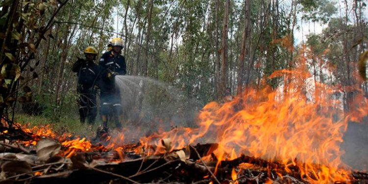
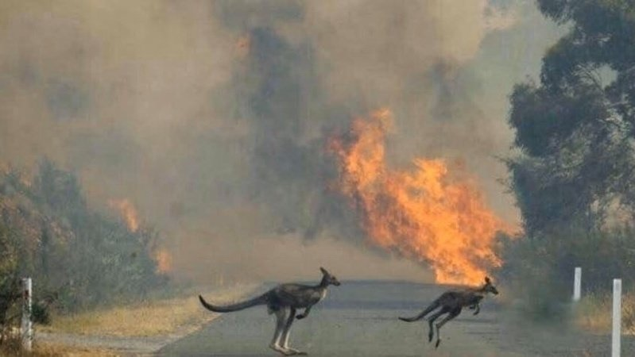
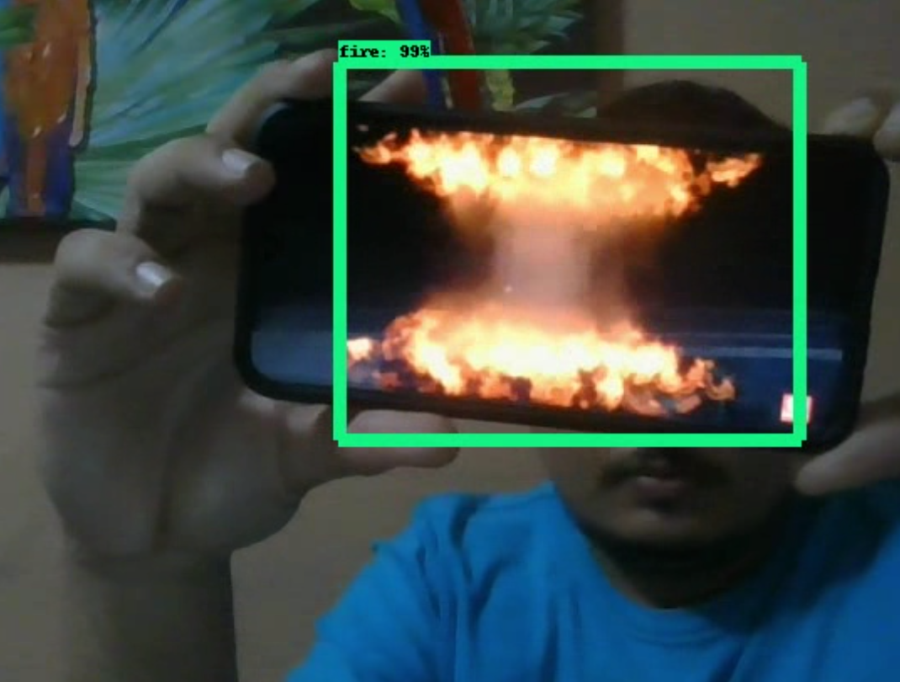
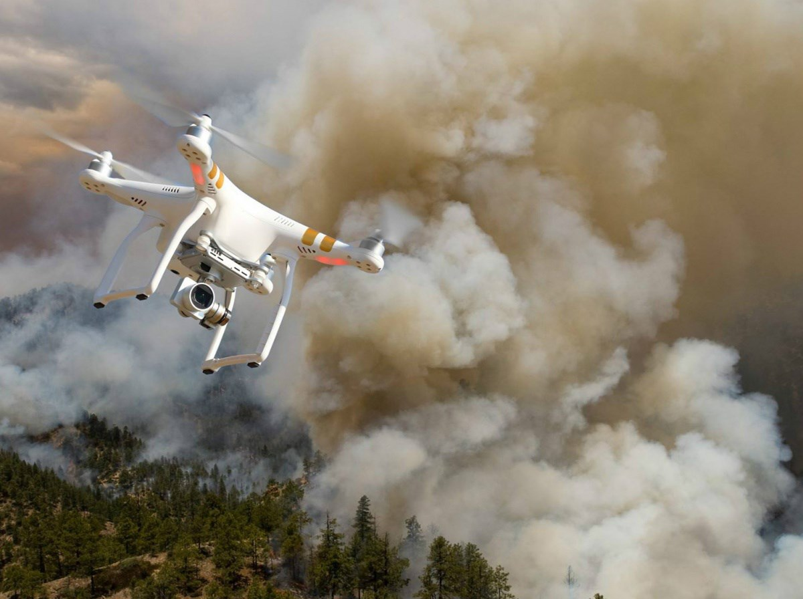

# Forest Fire detection with Machine Learning on Edge Devices.
Wildfire detection on edge devices using Tensorflow and OpenVINO

Wildfires are unplanned and unwanted fires, including lightning-caused fires, unauthorized human-caused fires, and escaped prescribed fire projects.

Just from my country I can share the following statistics:
* Wildfires devastate a total of 22,132 hectares of forests in 2019
* By February 10 of this month, 17 fires have been reported in the country.

In one of the most recent catastrophies, the Forest Fires in Australia have destroyed more than 11 million hectares, killing millions of animals and at least 33 people died. 

## Hardware
Edge Device: 
* Raspberry Pi 3b+
* Raspberry Pi Camera
* Looking to add the Neural Computer Stick (NCSv1.0 to boost inference)
Model was training in Coogle Colab with GPU Instance.

## Getting the data 
I will be using a dataset of images with the labels in xml format. We will convert this data from .xml to TFRecord to be able to use the Tensorflow Object Detection Pipeline.

## Converting the dataset and Model Training
Once we got the train.record and the test.record and the object-detection.pbtxt file we proceed with the enviroment preparatio and the training of the Object Detection model, this process is clerly described in the following Google Colab Notebook:
https://colab.research.google.com/drive/1j5uQtf74f4ZWEinip5DavlWWtaqBbxGe

## Converting the Tensorflow API model with OpenVino.
I have followed the steps described in the official Openvino documentation to be able to run in the raspberry pi in a faster way:
https://docs.openvinotoolkit.org/latest/_docs_MO_DG_prepare_model_convert_model_tf_specific_Convert_Object_Detection_API_Models.html 

For this I'm actually trying to build a docker iamge and container to provide the trained model easy to use. I hope to be able to have this available soon.

## Testing the model

Testing on the pi camera I have used the video input to test the model so I could get teh following results, this are the first test on flame images:

I will be adding more test results along the month.

## What this project is trying to achieve

This project is not limited to train a Deep Learning model to detect fire, I have started to work on a dron able to use electronics similar to Raspberry pi to detect fire during its **programmed flying route** across a forest or protected area and when the model indicates the presence of fire it will a SMS with the coordinates to the Forest Ranger and a MMS with the photo of the model prediction, this is possible with a raspberry pi GSM module.

